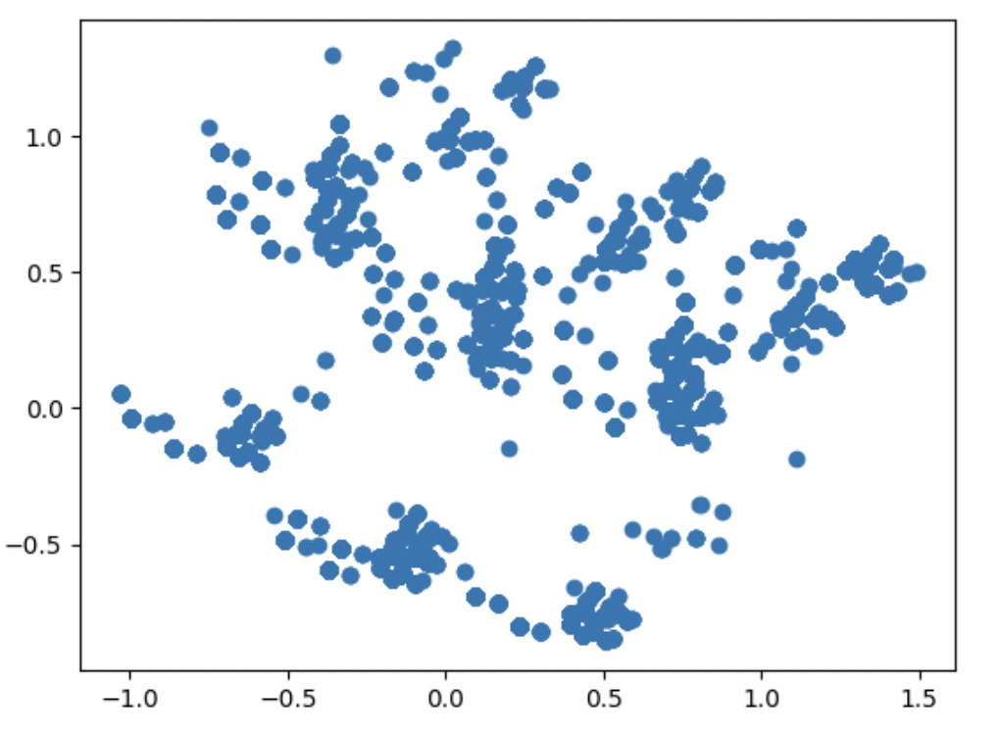
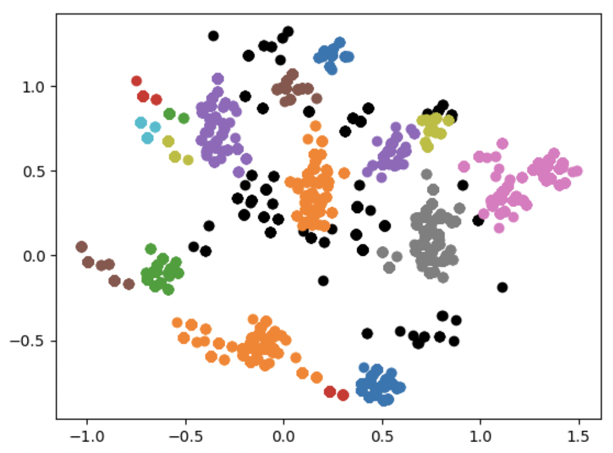
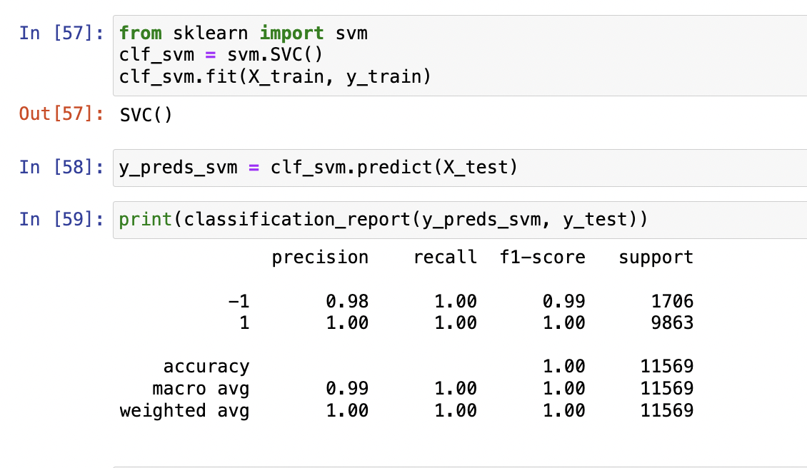

# Intro
This repo contains my solution if HTTP requests classification task

## Part 1: ML pipeline
### 1. Problem statement

We have a dataset with the following fields:
- CLIENT_IP
- CLIENT_USERAGENT 
- REQUEST_SIZE
- RESPONSE_CODE 
- MATCHED_VARIABLE_SRC
- MATCHED_VARIABLE_NAME
- MATCHED_VARIABLE_VALUE 
- EVENT_ID

Our task is to figure out whether a request, represented by these fields, is malicious or not

### 2. Solution
One can see all artifacts (EDA, preprocessing, model learning, building inference pipeline and feature importance) in notebook /jupyters/main.py
My solution steps:
- Feature engineering & preprocessing
- Dimensionality reduction using PCA algorithm for further clustering 
- Clustering (w/ DBSCAN in our case) of received features 
- Labeling (all outliers are supposed to be negative class samples)
- Binary classification using classic ML algos

### 3. Best score
I handled experiments with LogisticRegressionClassifier, SVM and DecisionTree; SVM showed best result on provided data:
- 

## Part 2: Inference 
Provided inference architecture consists of three services:
- PostgresDB for logging requests and prediction results
- App itself, getting request in format, proposed in problem statement:
`curl -X 'POST' \
'http://127.0.0.1:8000/predict' \
-H 'accept: application/json' \
-H 'Content-Type: application/json' \
-d '[{"data": "{\"CLIENT_IP\": \"188.138.92.55\", \"CLIENT_USERAGENT\": NaN, \"REQUEST_SIZE\": 166, \"RESPONSE_CODE\": 404, \"MATCHED_VARIABLE_SRC\": \"REQUEST_URI\", \"MATCHED_VARIABLE_NAME\": NaN, \"MATCHED_VARIABLE_VALUE\": \"//tmp/20160925122692indo.php.vob\", \"EVENT_ID\": \"AVdhXFgVq1Ppo9zF5Fxu\"}"}, {"data": "{\"CLIENT_IP\": \"93.158.215.131\", \"CLIENT_USERAGENT\": \"Mozilla/5.0 (Windows NT 6.3; WOW64; rv:45.0) Gecko/20100101 Firefox/45.0\", \"REQUEST_SIZE\": 431, \"RESPONSE_CODE\": 302, \"MATCHED_VARIABLE_SRC\": \"REQUEST_GET_ARGS\", \"MATCHED_VARIABLE_NAME\": \"url\", \"MATCHED_VARIABLE_VALUE\": \"http://www.galitsios.gr/?option=com_k2\", \"EVENT_ID\": \"AVdcJmIIq1Ppo9zF2YIp\"}"}]'` 
- Filler, voluming data directory, getting csv files with described fields, returning prediction results in data/output directory and logging requests to db

### Test app from local

    python3 ./app/main.py

By default app is available on ip=127.0.0.1, port=8000, but one can configure fastapi address via linux environment variables (defaults are provided in .env file).

Moreover, you can send demo request via running send_default_request.sh script (Note: it curls default port and host)

### Run docker

In project directory run:

    docker-compose up --build

This command:
- builds postgres container with configured username, password and port
- runs above described app depending on database service
- runs filler script: picks all *csv files from /data folder, sends all samples to app, gets predictions, logs them to database and closes container.

You can test app from local (need to curl localhost or 127.0.0.1) or from app container (need to curl "app" host)

To get all database logs (if any), you can:
1) Run from local `curl 127.0.0.1:8000/history` 
2) Run select query from database container:
    - open database container terminal (or use docker exec)
    - run `psql -U postgres` to authorize (or another name if changed in config)
    - optionally you can check that table was initialized: `\d` command must return "requests" table
    - run `SELECT * FROM requests;`

## Part 3: attracting attention

Thanks for attention c: